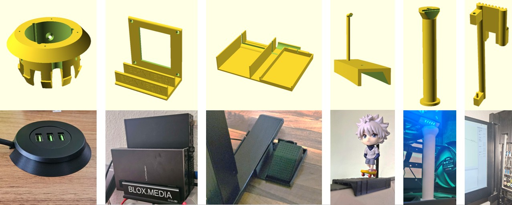
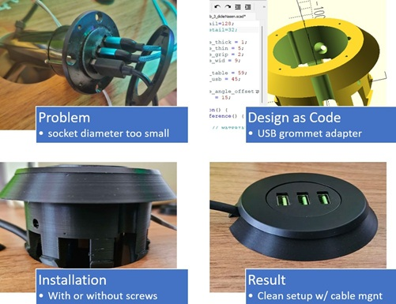
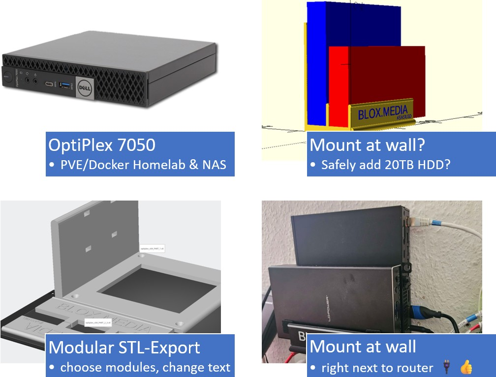
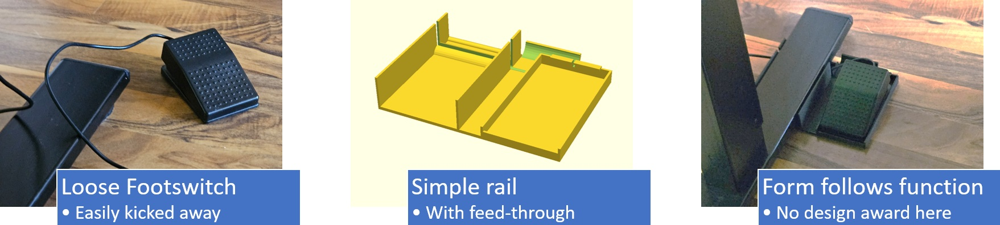
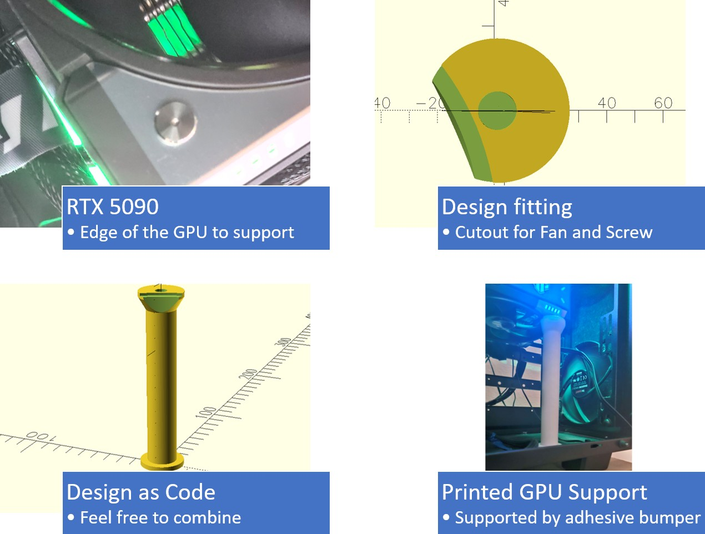
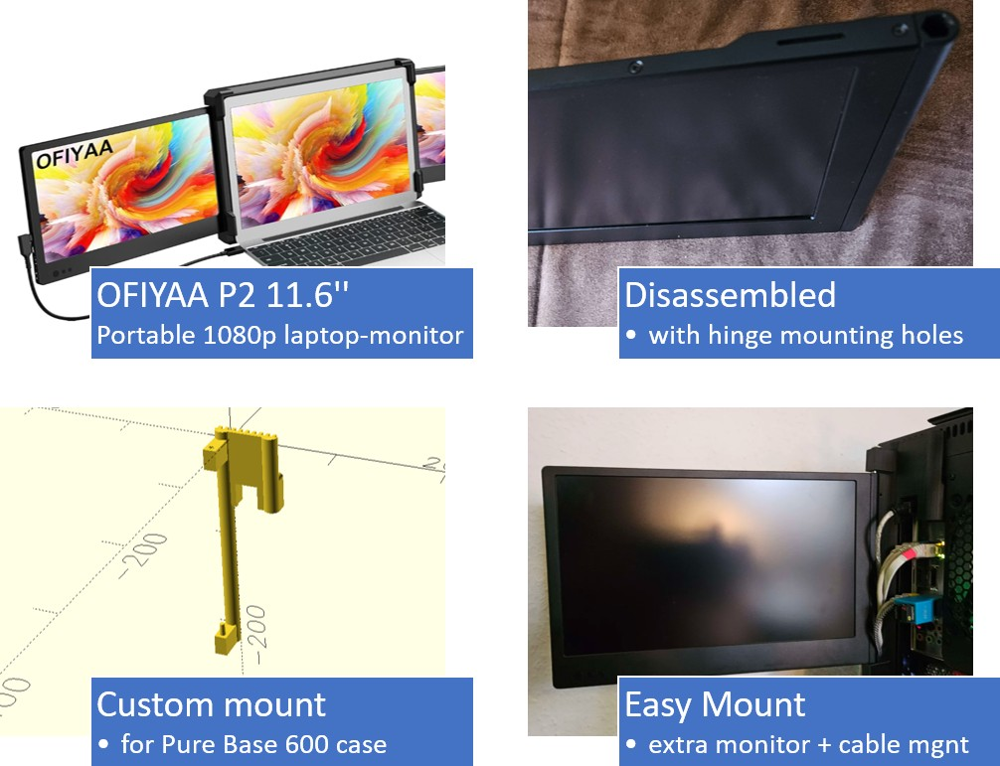

# 3d-openscad-printables
A small printables-as-code library of assorted parametric OpenSCAD models  

## Problem
1. STL-Models on makerworld etc. are fix
3. Modifications using Slicer Apps are bothersome and often inaccurate
3. Buying Fusion360 not quite cheap (plus closed source)

## solution approach
Design-as-Code approach OpenSCAD[https://openscad.org/] enabling parameters, logic and use Git versioning. It also can export STL-Files for your Slicer.  
Creating them can by time-consuming (even with ai), so I'm publishing my objects here for personal use.

## license
### CC BY-NC 4.0
This project is licensed under the [CC BY-NC 4.0 License](LICENSE.md).  

CC BY-NC 4.0 Matthias Block https://creativecommons.org/licenses/by-nc/4.0/legalcode  
This is to protect from Temu and mass-resellers, plase drop a message if you need commercial licenses or the license is hindering you from participating - just let me know!

# Models

---

## desk grommet adapter
Desk USB Hole Reducer Adapter  
  
This 3D-printed adapter reduces an oversized round desk hole (approximately 59 mm diameter) to fit a standard USB grommet (45 mm diameter). It features snap-fit locking tabs for secure installation and screw holes for mounting the USB module. The design includes cable cutouts and a flange for stable seating on the desk surface.  

### **Problem**

* The new desk has a 59 mm hole.
* The USB socket is 45 mm wide.
* The socket isn’t fully round due to the **screw bosses**.
* An extra cable for the Surface Dock needs to pass through.

### **Solution**

* A custom **59 mm → 45 mm adapter**.
* **Clearance for the screw bosses** of the USB module.
* A **cable feed-through** for the additional dock cable.
* **Snap tabs** to hold the module in place (though PLA tabs may be fragile).
* **Optional screw holes** to mount the adapter to the desk if the tabs fail.

### **Rating**

* + everysize is round, easy to design
* + works flawless
* + i used a tiny screw to fixate the adapter
* - snap tabs break easily (PLA material), so not many installation-tries, feed-through not easy to replace

### Parameters
* dia_table = 59; // outer diameter
* dia_usb = 45; // inner diameter 
* and some adjesments for the snaps/noses
* detail=128; // use 128 for print or 32 for faster preview
* nose_angle_offset = 15; // snaps adjustments may interfere with cutouts
* if you need >1 extra Feed-through, code needs to be adjusted (no parameter yet)

---

## Optiplex wall mount
Secure your Optiplex7050 Plus USB HDD together at the wall next to your Router.

### Problem
* The OptiPlex 7050 has no built-in wall-mounting points.
* A spinning USB HDD is fragile and can easily be damaged if not properly secured.
### Solution
* Simple modular wall mount
* Four recesses for countersunk screws
* customizable text (change color in slicer to get a nice contrast)
### Parameters
* fn=128; // default resolution
* test=false; // render optiplex and HDD placeholder (do NOT export STL!!!)
* export = 0; // export mode:
  * 0 = everything (prints as one part – not recommended)
  * 1 = **main part only**
  * 2 = walls only
  * 3 = **only one wall**  
sugegstion: export main part and 1 wall seperately and arrange them on your slicer (place 1 wall twice)
* do_text=true; // you want extruded text? disable if you do this with slicer
* wand_dicke = 5;  // thickness of walls and cutouts
* d_loch = 4.5;  // diameter countersunk recess
* wand_abstand = 36;  // distance between walls (thinkness of optiplex+bumber)
* optiplex_breite = 35.5;  // thickness OptiPlex 7050 in mm
* hdd_breite = 35.5;  // thickness HDD-Case in mm

* h_wand_1=150; // main wall (screw to your house)
* h_wand_2=30; // holds optiplex in place
* h_wand_3=30; // holds HDD case in place
* wand_hoehe = 50;  // Höhe der Platten in mm (Z-Richtung)
* wand_laenge = 150;  // how wide you want the whole wallmount?
* h_halter = 50;  // Höhe der Platten in mm (Z-Richtung)
* bohrloch_abstand = 10;  // distance countersunk recess to side
* bodenplatte_dicke = 10;  // The floor will carry Optiplex AND SPINNING HDD - dont make to thin!

* nase=10; // small retention bumps at the wall top

### Limitations / TODO
* after assembly, no streight access to countersunk 
* Fasten screws **BEFORE** assembly (or modify the walls)
* Increase thickness 10mm per device to add space for Optiplex rubber feets and bumpers
* buy self-adhesive bumpers from discounter, use as vibration-damping pads
* variables and comments currently german

---

## Footswitch Carriage
lock your USB HID Pedal along your Desktop Foot

### Problem
You unwantingly kick way your usb footswitch pedal
### Solution
* Horizontal table stand as rail to lock footswitch
* light cable management
### Rating
* + works - pedal always in place!
* + no glue or weird provisioning
* - not super solid if you kick it often
* - pretty ugly since only cylinder() and cube() was used
### Todo
* remake using advanced OpenSCAD libraries (not scheduled tho)

### Main Parameters:

## gpu_support_spacer_rtx5090
Minimalist GPU support cylinder with screw hole and fan outlet on top.

### Problem
* RTX 5090 is pretty heavy and the TUF Stand is too short
* Other GPU spacers would need Tape or Glue to fixate
### Solution
* Cylinder with cutout for fan and screw at the edge for stable stand
### Rating / TODO
* works
* upper part
* suggest vibration-reducing bumbers
* the stand if not super stable - you might want to make the lowest part wider
* the screw is a bit bigger - might need adjustment to fit even better.
* - The Design is functional but the Design aspect not too creative,
### Suggestion
In your slicer, combine the solid upper part with something more creative like an animefigure etc.

---

## anime figure stand (rail) for curved Samsung 9G Monitor
PLACEHOLDER

## mount portable monitor to pc back
Pure Base 600 mount with angles to attach a portable monitor

### Problem
This [11.6 inch 1080p dual-monitor](https://www.amazon.de/dp/B08VJCWBH2) extension for laptops I bought on amazon is mostly unsued and too heavy for my surface anyway.
### Solution
Permanently mount the Monitor on your [PC Case](https://www.amazon.de/dp/B06WVRDC41) using the vents on the back side.
### TODO (inactive)
* increase distance to pc case for besser cable management
* cutout for upper USB needs to be bigger
* fixation against left/right movement of lower part
* bolts not included yet
* more versatile usecase to mount different things
