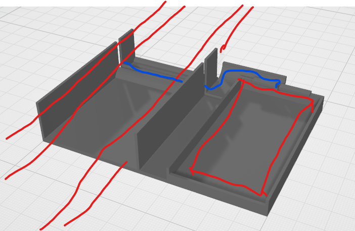

# 3d-openscad-printables
A small printables-as-code library of assorted parametric OpenSCAD models

## Problem
1. STL-Models on makerworld etc. are fix
3. Modifications using Slicer Apps are bothersome and often inaccurate
3. Buying Fusion360 not quite cheap (plus closed source)

## solution approach
Design-as-Code approach OpenSCAD[https://openscad.org/] enabling parameters, logic and use Git versioning. It also can export STL-Files for your Slicer.
Creating them can by time-consuming (even with ai), so I'm publishing my objects here for personal use.

## license
### CC BY-NC 4.0
I want to protect from Temu and mass-resellers, so I set the default license:

CC BY-NC 4.0 Matthias Block https://creativecommons.org/licenses/by-nc/4.0/legalcode
Please  drop a message if you need commercial licenses or the license is hindering you from participating - just let me know!

# Models

## desk grommet adapter
Desk USB Hole Reducer Adapter

This 3D-printed adapter reduces an oversized round desk hole (approximately 59 mm diameter) to fit a standard USB grommet (45 mm diameter). It features snap-fit locking tabs for secure installation and screw holes for mounting the USB module. The design includes cable cutouts and a flange for stable seating on the desk surface.

Hier ist eine saubere, klare und idiomatische englische Beschreibung basierend auf deiner Struktur:

### **Problem**

* The new desk has a 59 mm hole.
* The USB socket is 45 mm wide.
* The socket isn’t fully round due to the **screw bosses**.
* An extra cable for the Surface Dock needs to pass through.

### **Solution**

* A custom **59 mm → 45 mm adapter**.
* **Clearance for the screw bosses** of the USB module.
* A **cable feed-through** for the additional dock cable.
* **Snap tabs** to hold the module in place (though PLA tabs may be fragile).
* **Optional screw holes** to mount the adapter to the desk if the tabs fail.

### Parameters
* dia_table = 59; // outer diameter
* dia_usb = 45; // inner diameter 
* and some adjesments for the snaps/noses
* detail=128; // use 128 for print or 32 for faster preview
* nose_angle_offset = 15; // snaps adjustments may interfere with cutouts

---

## Footswitch Carriage
lock your USB HID Pedal along your Desktop Foot

### Main Parameters:

## gpu_support_spacer_rtx5090
Minimalist GPU support cylinder with screw hole and fan outlet on top.

