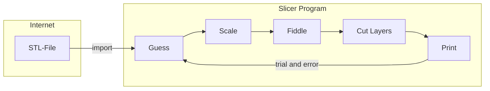
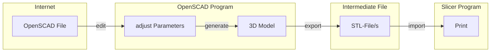
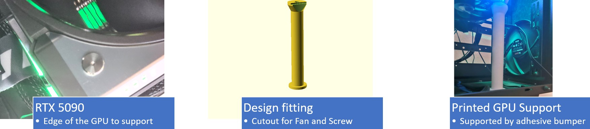
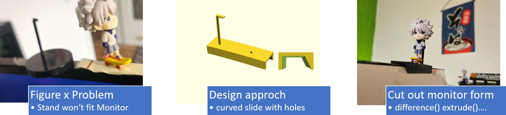

# 3d-openscad-printables

A small printables-as-code library of assorted parametric OpenSCAD models  

## Problem

1. STL-Models on makerworld etc. are fix
2. Modifications using Slicer Apps are bothersome and often inaccurate
3. Buying Fusion360 not quite cheap (plus closed source)

## solution approach

Design-as-Code approach [OpenSCAD](https://openscad.org/) enabling parameters, logic and use Git versioning.  
It allows STL-export for your Slicer.  
Creating object can be time-consuming and ai-support is quite limited, so I'm publishing my objects here for personal use and learn examples.

### STL workflow customizing STL-Files with Slicer

### OpenSCAD Workflow

## license

### CC BY-NC 4.0

This project is licensed under the [CC BY-NC 4.0 License](LICENSE.md).  

#### feel limited

This is to protect from Temu and mass-resellers, *plase drop a message* if you need commercial licenses or the license is hindering you from participating - just let me know!
CC BY-NC 4.0 Matthias Block [https://creativecommons.org/licenses/by-nc/4.0/legalcode](https://creativecommons.org/licenses/by-nc/4.0/legalcode)

## How to print

Either reach out to [Sasugamer 3D](https://sg3d.store/)  

### or export STL yourself

* install OpenSCAD from openscad.org
* clone repo
* load .scad
* set parameters (what to export)
* render F5/F6
* export F7 as STL

---

## Models

### desk grommet adapter {#grommet-problem}

Desk USB Hole Reducer Adapter  
  
This 3D-printed adapter reduces an oversized round desk hole (approximately 59 mm diameter) to fit a standard USB grommet (45 mm diameter). It features snap-fit locking tabs for secure installation and screw holes for mounting the USB module. The design includes cable cutouts and a flange for stable seating on the desk surface.  

#### **Problem** {#grommet-problem}

* The new desk has a 59 mm hole.
* The USB socket is 45 mm wide.
* The socket isn’t fully round due to the **screw bosses**.
* An extra cable for the Surface Dock needs to pass through.

#### **Solution** {#grommet-Solution}

* A custom **59 mm → 45 mm adapter**.
* **Clearance for the screw bosses** of the USB module.
* A **cable feed-through** for the additional dock cable.
* **Snap tabs** to hold the module in place (though PLA tabs may be fragile).
* **Optional screw holes** to mount the adapter to the desk if the tabs fail.

#### **Rating** {#grommet-Rating}

* :white_check_mark: everysize is round, easy to design
* :white_check_mark: works flawless
* :white_check_mark: i used a tiny screw to fixate the adapter
* :x: snap tabs break easily (PLA material), so not many installation-tries, feed-through not easy to replace

#### Parameters {#grommet-Parameters}

* dia_table = 59; // outer diameter
* dia_usb = 45; // inner diameter
* and some adjesments for the snaps/noses
* detail=128; // use 128 for print or 32 for faster preview
* nose_angle_offset = 15; // snaps adjustments may interfere with cutouts
* if you need >1 extra Feed-through, code needs to be adjusted (no parameter yet)

---

### Optiplex wall mount

Secure your Optiplex7050 Plus USB HDD together at the wall next to your Router.

#### Problem {#optiplex-problem}

* The OptiPlex 7050 has no built-in wall-mounting points.
* A spinning USB HDD is fragile and can easily be damaged if not properly secured.

#### Solution {#optiplex-Solution}

* Simple modular wall mount
* Four recesses for countersunk screws
* customizable text (change color in slicer to get a nice contrast)

#### external Libraries {#optiplex-Libraries}

Some functions are outsorced (sinkhole and curved cube):  
They are needed for render and export:

* _bohr_senk.scad
* _round_edge.scad
* (_wall_with_holes.scad)

#### Parameters {#optiplex-Parameters}

* fn=128; // default resolution
* test=false; // render optiplex and HDD placeholder (do NOT export STL!!!)
* export = 0; // export mode:
  * 0 = everything (prints as one part – not recommended)
  * 1 = **main part only**
  * 2 = walls only
  * 3 = **only one wall**  
sugegstion: export main part and 1 wall seperately and arrange them on your slicer (place 1 wall twice)
* do_text=true; // you want extruded text? disable if you do this with slicer
* wand_dicke = 5;  // thickness of walls and cutouts
* d_loch = 4.5;  // diameter countersunk recess
* wand_abstand = 36;  // distance between walls (thinkness of optiplex+bumber)
* optiplex_breite = 35.5;  // thickness OptiPlex 7050 in mm
* hdd_breite = 35.5;  // thickness HDD-Case in mm

* h_wand_1=150; // main wall (screw to your house)
* h_wand_2=30; // holds optiplex in place
* h_wand_3=30; // holds HDD case in place
* wand_hoehe = 50;  // Höhe der Platten in mm (Z-Richtung)
* wand_laenge = 150;  // how wide you want the whole wallmount?
* h_halter = 50;  // Höhe der Platten in mm (Z-Richtung)
* bohrloch_abstand = 10;  // distance countersunk recess to side
* bodenplatte_dicke = 10;  // The floor will carry Optiplex AND SPINNING HDD - dont make to thin!

* nase=10; // small retention bumps at the wall top

#### Limitations / TODO {#optiplex-TODO}

* after assembly, no streight access to countersunk
* Fasten screws **BEFORE** assembly (or modify the walls)
* Increase thickness 10mm per device to add space for Optiplex rubber feets and bumpers
* buy self-adhesive bumpers from discounter, use as vibration-damping pads
* variables and comments currently german

---

### Footswitch Carriage

lock your USB HID Pedal along your Desktop Foot

#### Problem {#Footswitch-problem}

You unwantingly kick way your usb footswitch pedal

#### Solution {#Footswitch-Solution}

* Horizontal table stand as rail to lock footswitch
* light cable management

#### Rating {#Footswitch-Rating}

* ✅ works - pedal always in place!
* ✅ no glue or weird provisioning
* ❌ not super solid if you kick it often
* ❌ pretty ugly since only cylinder() and cube() was used

#### Todo {#Footswitch-Todo}

* remake using advanced OpenSCAD libraries (not scheduled tho)

#### Main Parameters {#Footswitch-Parameters}

TODO

### gpu_support_spacer_rtx5090

Minimalist GPU support cylinder with screw hole and fan outlet on top.

#### Problem {#gpu-problem}

* RTX 5090 is pretty heavy and the TUF Stand is too short
* Other GPU spacers would need Tape or Glue to fixate

#### Solution {#gpu-Solution}

* Cylinder with cutout for fan and screw at the edge for stable stand

#### Rating / TODO {#gpu-TODO}

* works
* upper part
* suggest vibration-reducing bumbers
* the stand if not super stable - you might want to make the lowest part wider
* the screw is a bit bigger - might need adjustment to fit even better.
* The Design is functional but the Design aspect not too creative,

#### Suggestion {#gpu-Suggestion}

In your slicer, combine the solid upper part with something more creative like an animefigure etc.

---

### anime figure stand (rail) for curved Samsung 9G Monitor

#### Problem {#animeslider-Problem}

* Anime figures come with simple stands, you cannot put them on your monitor without glueing.
* My [monitor](https://www.amazon.de/dp/B08SW6P7CH) has radius=1m and a an angled egde, so the slider cannot be simple 90°.

#### Solution {#animeslider-Solution}

* create an angled shape and partly extrude it from a r=1000mm position, add hole and a holder.

#### Export parameters {#animeslider-parameters}

check main() func on file bottom:

* schiene(); the main curved slider
* hangman() the figure holder - print seperately!
* cylinder(); hole(s) to place hangman or other stuff

### mount portable monitor to pc back

Pure Base 600 mount with angles to attach a portable monitor

#### Problem {#monitor-Problem}

This [11.6 inch 1080p dual-monitor](https://www.amazon.de/dp/B08VJCWBH2) extension for laptops I bought on amazon is mostly unsued and too heavy for my surface anyway.

#### Solution {#monitor-Solution}

Permanently mount the Monitor on your [PC Case](https://www.amazon.de/dp/B06WVRDC41) using the vents on the back side.

#### TODO (inactive) {#monitor-TODO}

* increase distance to pc case for besser cable management
* cutout for upper USB needs to be bigger
* fixation against left/right movement of lower part
* bolts not included yet
* more versatile usecase to mount different things
